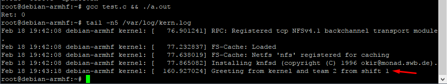

# Σχεδιασμός Ενσωματωμένων Συστημάτων

### Αναφορά 3ης Άσκησης | Βάρδια 1 Ομάδα 2

|||
|--------|------|
| Γρηγόρης Μαντάος |03113171|
| Γαβαλάς Νικόλαος |03113121|

### Cross-compiling προγραμμάτων για ARM αρχιτεκτονική

## Άσκηση 1

Αρχικά ακολουθήσαμε τις οδηγίες για την εγκατάσταση και χρήση του crosstool-ng. Αφού το εγκαταστήσαμε, επιλέξαμε target machine arm-cortexa9_neon-linux-gnueabihf, glibc, και προχωρήσαμε στο χτίσιμο του cross-compiler. Ύστερα κατεβάσαμε και τον precompiled cross-compiler linaro.

### 1. 

Επιλέξαμε την αρχιτεκτονική "arm-cortexa9_neon-linux-gnueabihf" επειδή κανουμε target το vm της πρώτης άσκησης που έκανε emulate arm αρχιτεκτονική (arm cortex a9 με elf abi και hard float). 

Αν επιλέγαμε κάποια μη-ARM αρχιτεκτονική, το OS δεν θα αναγνώριζε το εκτελέσιμο και θα επέστρεφε `exec format error`.

### 2. 

Χρησιμοποιώντας την παρακάτω εντολή: 

```
ldd -v ~/x-tools/arm-cortexa9_neon-linux-gnueabihf/bin/arm-linux-gnueabihf-gcc
```
βλέπουμε ότι χρησιμοποιήσαμε την glibc (GNU C lib)

```bash
linux-vdso.so.1 (0x00007fffebec6000)
libstdc++.so.6 => /usr/lib/x86_64-linux-gnu/libstdc++.so.6 (0x00007fba1113e000)
libm.so.6 => /lib/x86_64-linux-gnu/libm.so.6 (0x00007fba10e3a000)
libc.so.6 => /lib/x86_64-linux-gnu/libc.so.6 (0x00007fba10a9b000)
/lib64/ld-linux-x86-64.so.2 (0x00007fba114c0000)
libgcc_s.so.1 => /lib/x86_64-linux-gnu/libgcc_s.so.1 (0x00007fba10884000)

 Version information:
./arm-cortexa9_neon-linux-gnueabihf-gcc:
  libstdc++.so.6 (CXXABI_1.3.9) => /usr/lib/x86_64-linux-gnu/libstdc++.so.6
  libstdc++.so.6 (GLIBCXX_3.4) => /usr/lib/x86_64-linux-gnu/libstdc++.so.6
  libc.so.6 (GLIBC_2.11) => /lib/x86_64-linux-gnu/libc.so.6
  libc.so.6 (GLIBC_2.14) => /lib/x86_64-linux-gnu/libc.so.6
  libc.so.6 (GLIBC_2.3) => /lib/x86_64-linux-gnu/libc.so.6
  libc.so.6 (GLIBC_2.2.5) => /lib/x86_64-linux-gnu/libc.so.6
```

### 3.

```bash
$ file phods.out
```

```bash
phods.out: ELF 32-bit LSB executable, ARM, EABI5 version 1 (SYSV), dynamically linked, interpreter /lib/ld-linux-armhf.so.3, for GNU/Linux 3.2.0, not stripped 
```

```bash
$ readelf -h -A phods.out
```

```bash
ELF Header:
  Magic:   7f 45 4c 46 01 01 01 00 00 00 00 00 00 00 00 00
  Class:                             ELF32
  Data:                              2s complement, little endian
  Version:                           1 (current)
  OS/ABI:                            UNIX - System V
  ABI Version:                       0
  Type:                              EXEC (Executable file)
  Machine:                           ARM
  Version:                           0x1
  Entry point address:               0x1038c
  Start of program headers:          52 (bytes into file)
  Start of section headers:          15548 (bytes into file)
  Flags:                             0x5000400, Version5 EABI, hard-float ABI
  Size of this header:               52 (bytes)
  Size of program headers:           32 (bytes)
  Number of program headers:         8
  Size of section headers:           40 (bytes)
  Number of section headers:         37
  Section header string table index: 34
Attribute Section: aeabi
File Attributes
  Tag_CPU_name: "Cortex-A9"
  Tag_CPU_arch: v7
  Tag_CPU_arch_profile: Application
  Tag_ARM_ISA_use: Yes
  Tag_THUMB_ISA_use: Thumb-2
  Tag_FP_arch: VFPv3
  Tag_Advanced_SIMD_arch: NEONv1
  Tag_ABI_PCS_wchar_t: 4
  Tag_ABI_FP_rounding: Needed
  Tag_ABI_FP_denormal: Needed
  Tag_ABI_FP_exceptions: Needed
  Tag_ABI_FP_number_model: IEEE 754
  Tag_ABI_align_needed: 8-byte
  Tag_ABI_align_preserved: 8-byte, except leaf SP
  Tag_ABI_enum_size: int
  Tag_ABI_VFP_args: VFP registers
  Tag_CPU_unaligned_access: v6
  Tag_MPextension_use: Allowed
  Tag_Virtualization_use: TrustZone
```
Οι εντολές αυτές δίνουν πληροφορίες από τα headers του binary αρχείου σχετικά με τον τύπο του, το ABI, targeted architecture κλπ.

Συγκεκριμένα, συμπεραίνουμε τα ακόλουθα:
- Type: Executable
- ΑΒΙ: ELF 32-bit EABI5 version 1 (SYSV)
- Endianess: Little Endian
- Interpreter: /lib/ld-linux-armhf.so.3, for GNU/Linux 3.2.0, not 
- Target: ARM
- Misc: not stripped, dynamically linked
- Magic: 7f 45 4c 46 01 01 01 00 00 00 00 00 00 00 00 00
- CPU_name: "Cortex-A9"
- CPU_arch: v7
- CPU_arch_profile: Application
- ARM_ISA_use: Yes
- THUMB_ISA_use: Thumb-2


### 4.

- Compiled Toolchain: 20KB
- Precompiled (Linaro): 8KB

Ναι υπάρχει διαφορά. Οπότε ελέγχουμε το αποτέλεσμα της `ldd` για τον linaro cross-compiler.

```bash
$ ldd -v arm-linux-gnueabihf-gcc-4.8.3
```

```bash
linux-gate.so.1 (0xf77a3000)
libstdc++.so.6 => /usr/lib/i386-linux-gnu/libstdc++.so.6 (0xf7609000)
libm.so.6 => /lib/i386-linux-gnu/libm.so.6 (0xf75b4000)
libpthread.so.0 => /lib/i386-linux-gnu/libpthread.so.0 (0xf7595000)
libdl.so.2 => /lib/i386-linux-gnu/libdl.so.2 (0xf7590000)
libgcc_s.so.1 => /lib/i386-linux-gnu/libgcc_s.so.1 (0xf7572000)
libc.so.6 => /lib/i386-linux-gnu/libc.so.6 (0xf73ba000)
/lib/ld-linux.so.2 (0xf77a5000)

Version information:
./arm-linux-gnueabihf-gcc-4.8.3:
  libstdc++.so.6 (GLIBCXX_3.4) => /usr/lib/i386-linux-gnu/libstdc++.so.6
  libc.so.6 (GLIBC_2.3) => /lib/i386-linux-gnu/libc.so.6
  libc.so.6 (GLIBC_2.2) => /lib/i386-linux-gnu/libc.so.6
  libc.so.6 (GLIBC_2.1) => /lib/i386-linux-gnu/libc.so.6
  libc.so.6 (GLIBC_2.1.3) => /lib/i386-linux-gnu/libc.so.6
  libc.so.6 (GLIBC_2.0) => /lib/i386-linux-gnu/libc.so.6
```
Παρατηρούμε ότι ο cross-compileer αυτός κάνει reference τις `i386` βιβλιοθήκες της C, πράγμα που είχαμε παρατηρήσει και από πιο πριν καθώς στο μηχανημά μας χρειάστηκε να εγκαταστήσουμε πολλά packages για 32-bit support.

Οπότε η διαφορά στο μέγεθος του εκτελέσιμου οφείλετε στο ότι το toolchain που κάναμε compile εμείς χρησιμοποιεί τις 64-bit βιβλιοθήκες, όπως φαίνετε και στη εκτέλεση της `ldd` στο δεύτερο ερώτημα.

### 5. 

Διότι ένα 64-bit σύστημα μπορεί να εκτελέσει και 32-bit προγράμματα.

### 6.

|  | Normal | Static |
| --- | --- | --- |
| Compiled Toolchain | 20K | 4M |
| Linaro Toolchain | 8K | 496K |

Όπως και πριν, το artifact του δικού μας toolchain βγήκε αισθητά μεγαλύτερο καθώς και λόγω του static linking έχει ενσωματομένες όλες τις 64-bit βιβλιοθήκες της C που κάνει reference το πρόγραμμα `phods`.

### 7.

- **A.** Στο host δεν θα τρέξει γιατί είναι παράγωγο cross compilation για άλλη αρχιτεκτονική.
- **B.** Στο target επίσης δεν θα τρέξει γιατί του λείπει η μεταποιημένη βιβλιοθήκη. 
- **C.** Θα τρέξει γιατί με static linking οι συναρτήσεις που χρειάζονται είναι ενσωματωμένες στο τελικό εκτελέσιμο.


## Άσκηση 2

Χρησιμοποιώντας τον cross-compiler που κάναμε compile εμείς για το χτίσιμο του πυρήνα, οδηγούμασταν σε error σχετικά με κάποια missing βιβλιοθήκη, οπότε αντί να ερευνήσουμε το πρόβλημα παραπάνω, επιλέξαμε να χρησιμοποιήσουμε τον linaro cross-compiler καθώς και με αυτόν τον build ήταν επιτυχίες από την πρώτη προσπάθεια.

Αρχικά ελέγξαμε τη version του kernel και τα περιεγχόμενα του `/boot` directory σύμφωνα με την εκφώνηση.

```
$ root@debian-armhf:~# uname -a

Linux debian-armhf 3.2.0-4-vexpress #1 SMP Debian 3.2.51-1 armv7l GNU/Linux
```

```
$ root@debian-armhf:/boot# ls

config-3.2.0-4-vexpress      System.map-3.2.0-4-vexpress
initrd.img                   vmlinuz
initrd.img-3.2.0-4-vexpress  vmlinuz-3.2.0-4-vexpress
lost+found
```

Μετα την εγκατάσταση των `.deb` packages παρατηρήσαμε ότι στο `/boot` directory, το σύστημα χρησιμοποίησε τα patches αυτά και τον kernel του για να παράξει το updated image.

```
$ root@debian-armhf:/boot# ls

config-3.2.0-4-vexpress      System.map-3.2.0-4-vexpress
config-3.2.96                System.map-3.2.96
initrd.img                   vmlinuz
initrd.img-3.2.0-4-vexpress  vmlinuz-3.2.0-4-vexpress
initrd.img-3.2.96            vmlinuz-3.2.96
lost+found
```

Χρησιμοποιώντας τώρα το καινούργιο `initrd.img-3.2.96` και το καινούργιο `vmlinuz-3.2.96` ως image, εκκινήσαμε καινούργιο VM με το qemu, στο οποίο όντως και παρατηρήσαμε ότι η version του kernel ήταν η `3.2.96` που μόλις κάναμε build.

```
$ root@debian-armhf:~# uname -a

Linux debian-armhf 3.2.96 #1 SMP Sat Feb 17 11:03:00 EST 2018 armv7l GNU/Linux
```

Για την υλοποίηση του ζητούμενου syscall αλλάξαμε το source του πυρήνα ως εξής:

Αρχικά δημιουργήσαμε το αρχείο custom.c (και το αντίστοιχο Makefile) που περιέχει τη συνάρτηση που καλείται κατά το syscall:

##### [linux-source/custom/custom.c](linux-source/custom/custom.c)

```c
#include <linux/kernel.h>

asmlinkage long sys_custom(void)
{
	printk(KERN_ALERT "Greeting from kernel and team 2 from shift 1\n");
	return 0;
}
```

όπου η συνάρτηση printk είναι αυτή που τυπώνει τα μηνύματα πυρήνα.

Ύστερα κάνουμε "register" το syscall στο header file του πυρήνα linux-source/incluce/linux/syscalls.h προσθέτοντας στο τέλος του την εξής γραμμή:

##### [linux-source/include/linux/syscalls.h:860](linux-source/include/linux/syscalls.h#L860)

```c
asmlinkage long sys_custom(void);
```

Ομοίως προσθέτουμε στο linux-source/arch/arm/include/asm/unistd.h τη γραμμή

##### [linux-source/arch/arm/include/asm/unistd.h:407](linux-source/arch/arm/include/asm/unistd.h#L407)

```c
#define __NR_sys_custom	(__NR_SYSCALL_BASE+378)
```

, στο linux-source/arch/arm/kernel/calls.S τη γραμμή

##### [linux-source/arch/arm/kernel/calls.S:391](linux-source/arch/arm/kernel/calls.S#L391)

```c
/* 378 */
CALL(sys_custom)
```

και τέλος στο linux-source/arch/x86/kernel/syscall_table_32.S τη γραμμή

##### [linux-source/arch/x86/kernel/syscall_table_32.S:351](linux-source/arch/x86/kernel/syscall_table_32.S#L351)

```c
.long sys_custom
```

Έπειτα, συμπεριλαμβάνουμε το directory με το source του syscall μας ("custom/") στο root-level Makefile του kernel-source, αλλάζοντας τη γραμμή 711 ως εξής:

##### [linux-source/Makefile:711](linux-source/Makefile#L711)

```
core-y		+= kernel/ mm/ fs/ ipc/ security/ crypto/ block/ custom/
```

Τέλος μεταγλωττίζουμε τον πυρήνα, τον τρέχουμε με το qemu και τρέχουμε και το test.c (ένα driver πρόγραμμα σε C που χρησιμοποιεί το syscall και τυπώνει το exit code του).

Βλέπουμε ότι το exit code είναι 0, και εκτελώντας `$ dmesg` βλέπουμε ότι έχει τυπωθεί στα logs του kernel `Greeting from kernel and team 2 from shift 1`, επιβεβαιώνοντας την ορθή λειτουργία του syscall μας:

